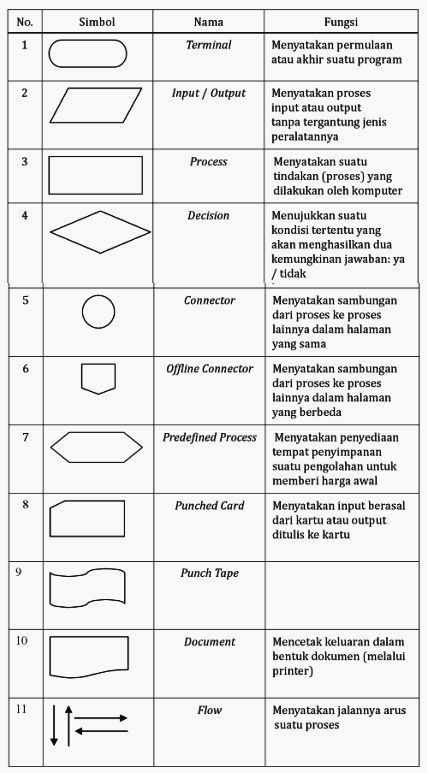

# Pengantar Algoritma dan Pemrograman

Pengantar Diskusi:

* **Manusia selalu hidup dengan persoalan (Problem)**
* **Problem/persoalan adalah sesuatu yang harus diselesaikan**
* **Persoalan adalah pertanyaan yang harus dicari jawabannya**

## Sejarah Algoritma

> **"Saya heran ada orang-orang yang terlalu mengidolakan saya, padahal saya sangat mengidolakan** [**ilmuwan**](https://www.sindonews.com/topic/2373/ilmuwan) **muslim Al-Khawarizmi karena tanpa ilmu yang ditemukannya yakni Algoritma dan Aljabar, maka jangan pernah bermimpi ada facebook ini ,"ujar Mark** yang sangat fenomenal. Siapa sebenarnya Al-Khawarizmi ini?

<figure><figcaption></figcaption></figure>

Dikutip dalam buku Algoritma dan Pemograman (Syamsu Alam) Pada 1950, algoritma pertama kali digunakan pada Algoritma Eucliden (Euclid Algorithm). Euclid sendiri merupakan seorang matematikawan Yunani yang lahir sekitar 350 SM. Euclid menulis buku yang berjudul Element. Di dalam buku tersebut, jelaskan langkah-langkah untuk menemukan pembagi bersama terbesar (common greatest divisor) dari dua bilangan bulat.&#x20;

Namun, Eucliden pada saat itu tidak menyebutkan bahwa cara yang digunakannya adalah metode algoritma. Hal tersebut baru disebut sebagai algoritma pada abad-abad modern. Dalam bahasa Indonesia, kata algorithm diserap menjadi algoritma.

## Pengertian Algoritma

_**Algoritma adalah urutan langkah-langkah logis penyelesaian masalah yang disusun secara sistematis dan logis**_

Algoritma adalah urutan langkah-langkah sistematis, lengkap dan logis untuk menyelesaikan suatu masalah. Kata logis merupakan kata kunci dalam algoritma. Langkah-langkah dalam algoritma harus logis dan harus dapat ditentukan bernilai salah atau benar.

Pembuatan algoritma mempunyai banyak keuntungan di antaranya:&#x20;

1. Pembuatan atau penulisan algoritma tidak tergantung pada bahasa pemrograman manapun, artinya penulisan algoritma independen dari bahasa pemrograman dan komputer yang melaksanakannya.&#x20;
2. Notasi algoritma dapat diterjemahkan ke dalam berbagai bahasa pemrograman.&#x20;
3. Apapun bahasa pemrogramannya, output yang akan dikeluarkan sama karena algoritmanya sama

## Perbedaan Algoritma dan Program

Algoritma adalah prosedur logis untuk memecahkan masalah tertentu. Sementara program mengacu pada serangkaian instruksi untuk diikuti oleh komputer. Suatu program bisa terdiri dari banyak algoritma atau bahkan tidak mengandung algoritma.

Secara garis besar, berikut beberapa perbedaan algoritma dan program berdasarkan Naukri Learning:

* Algoritma memecahkan masalah, sementara program komputer mengimplementasikannya dalam bentuk yang dapat dijalankan komputer.
* Algoritma ditulis dengan bahasa biasa dan dapat dipahami oleh mereka yang memiliki _background non-programmer_. Program ditulis dalam bahasa khusus, seperti [Python](https://revou.co/panduan-teknis/python-adalah), Javascript, dan C++.

Algoritma dapat diekspresikan dalam _natural language,_ [_flowchart_](https://revou.co/kosakata/flowchart)_, pseudocode,_ dan berbagai [bahasa pemrograman](https://revou.co/panduan-teknis/bahasa-pemrograman). Program ditulis dalam bahasa komputer.

_**Dalam referensi lain:**_

Program  adalah kumpulan pernyataan komputer, sedangkan metode dan tahapan sistematis dalam program adalah algoritma. Program ditulis dengan menggunakan bahasa pemrograman. Jadi bisa disebut bahwa program adalah suatu implementasi dari bahasa pemrograman. Wirth (1997) menyatakan dalam bukunya bahwa :


**Algoritma + Struktur Data = Program**


Bagaimanapun juga struktur data dan algoritma berhubungan sangat erat pada sebuah program. Algoritma yang baik tanpa pemilihan struktur data yang tepat akan membuat program menjadi kurang baik, demikian juga sebaliknya. Dalam pembuatan algoritma mempunyai

banyak keuntungan di antaranya:

* Pembuatan atau penulisan algoritma tidak tergantung pada bahasa pemrograman manapun, artinya penulisan algoritma independen dari bahasa pemrograman dan komputer yang melaksanakannya.
* Notasi algoritma dapat diterjemahkan ke dalam berbagai bahasa pemrograman.
* Apapun bahasa pemrogramannya, output yang akan dikeluarkan sama karena algoritmanya sama.

Agar algoritma bisa ditranslasikan ke dalam bahasa pemrograman, ada beberapa hal yang harus diperhatikan pada translasi tersebut, yaitu:

Pendeklrasian Variabel

Untuk mengetahui dibutuhkannya pendeklarasian variabel dalam penggunaan bahasa pemrograman apabila tidak semua bahasa pemrograman membutuhkannya.

Pemilihan Tipe Data

Apabila bahasa pemrograman yang akan digunakan membutuhkan pendeklarasian variabel maka perlu hal ini dipertimbangkan pada saat pemilihan tipe data.

Pemakaian Instruksi-instruksi

Beberapa instruksi mempunyai kegunaan yang sama tetapi masing-masing memiliki kelebihan dan kekurangan yang berbeda.

\

Aturan Sintaks

Pada saat menuliskan program kita terikat dengan aturan sintaksis dalam bahasa pemrograman yang akan digunakan.

Tampilan Hasil

Pada saat membuat algoritma kita tidak memikirkan tampilan hasil yang akan disajikan. Hal-hal teknis ini diperhatikan ketik mengkonversikannya menjadi program.

\

